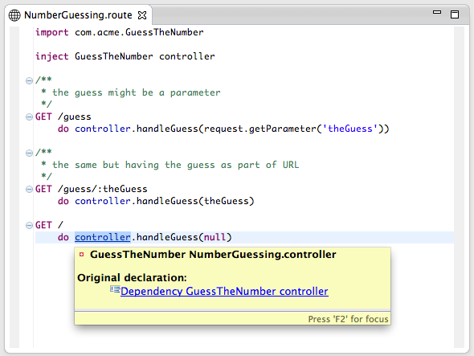

# HTTP Routing Language {#http-routing}

This is a little language that lets you dispatch incoming HTTP requests.



## Overview {#routing-solution}

For server-side web development one needs to match any incoming HTTP requests to some handling code. A request is defined by a HTTP method (i.e. GET, POST, etc.), a URL and maybe some other data (headers, parameters, etc.). In the Java world there are many different solutions to this problem. Java Servlets come with an external configuration (web.xml), where you configure what servlet should be called for which URLs. JAX-RS (JSR-311) uses annotations to match incoming URLs and other frameworks have their own external DSLs for that.

The HTTP routing language explained in this section uses an approach very similar to the one from the [Play framework](http://playframework.org). You basically declare a list of URL patterns and explain what to do for each case. In contrast to Play! which heavily relies on static methods, you can also declare so called dependencies which are translated to fields annotated with `@Inject`. So this DSL plays nicely with dependency injection and especially with the [Guice modules DSL](05_guice.md).

```routing
inject GuessTheNumber controller

GET /guess/:theGuess
  do controller.handleGuess(theGuess)
```

As you can see, you can have named variable placeholders in the URL and use them in the `do`-part. There also is a `when`-part which allows to specify an additional condition using the request object as well as any parameters:

```routing
inject GuessTheNumber controller

GET /guess/:theGuess
  when !controller.isValidGuess(theGuess)
  do controller.handleWrongRange(theGuess)

GET /guess/:theGuess
  do controller.handleGuess(theGuess)
```

## Running the Example {#routing-running}

The example project's name is *org.xtext.httprouting.examples* and includes a simple but runnable number guessing game. Just start the server (an embedded Jetty) by running `framework.StartServer` as a Java Application. Then point your browser to the URL [http://localhost:8080/guess](http://localhost:8080/guess).

## Grammar {#routing-grammar}

The Routing DSL extends *org.eclipse.xtext.xbase.annotations.XbaseWithAnnotations* to make use of expressions predefined by [Xbase](https://www.eclipse.org/Xtext/documentation/305_xbase.html#xbase-expressions) plus support for Annotations. 

```xtext
grammar org.xtext.httprouting.Route 
  with org.eclipse.xtext.xbase.annotations.XbaseWithAnnotations

generate route "http://www.xtext.org/httprouting/Route"
import "http://www.eclipse.org/xtext/common/JavaVMTypes" as types
import "http://www.eclipse.org/xtext/xbase/Xbase" as xbase

Model :
	importSection=XImportSection?
	declarations+=AbstractDeclaration*;

AbstractDeclaration :
	Dependency | Route;

Dependency :
	'inject' annotations+=XAnnotation? type=JvmTypeReference name=ID;

Route :
	requestType=RequestType url=URL 
	('when' condition=XExpression)? 
	'do' call=XExpression;

enum RequestType :
	GET | POST | PUT | DELETE | HEAD;

/**
 * matches URLs like 
 * 	'/foo/bar.html' or 
 * 	'/customer/:customerID/save'
 */
URL :
	{URL} 
	( '/' | ('/' (QualifiedName | variables+=Variable))* 
	('/' variables+=Variable wildcard?='*')?);

Variable :
	':' name=ID;
```

There should not be any surprises if you know the grammar language: A *Model* consists of an *XImportSection* followed by any number of *Dependencies* and *Routes*. A *Route* starts with a *RequestType*, i.e. HTTP method, followed by a *URL* pattern. Then an optional when-clause can be specified followed by a mandatory do-clause.

## Translation to Java {#routing-inferrer}

In [RouteJvmModelInferrer](https://github.com/xtext/seven-languages-xtext/blob/master/languages/org.xtext.httprouting/src/org/xtext/httprouting/jvmmodel/RouteJvmModelInferrer.xtend) you can see that a Java class extending the class [HttpServlet](https://docs.oracle.com/javaee/7/api/javax/servlet/http/HttpServlet.md) is derived. First the *Dependencies* are translated to Java fields. This is almost a one-to-one mapping.

```xtend
// translate the dependencies to fields annotated with @Inject
for (field : model.declarations.filter(Dependency)) {
  members += field.toField(field.name, field.type) [
    annotations += annotationRef(Inject)
		addAnnotations(field.annotations)
  ]
}
```

Next up a field for the *URL* patterns is generated and a method for the used expressions, such giving them a proper scope and context.

```xtend
// declare fields for the URL regexp, a method for each when-part 
// and of course the call part of a route
for (route : model.routes.filter[ url != null ]) {
  members += route.toRoutePatternField
  if (route.condition != null)
    members += route.toRouteConditionMethod
  members += route.toRouteCallMethod
}
```

Note that the code in a model inferrer has to be very defensive, because it is called for any kind of broken models. You just cannot assume that the URL is set although it is mandatory in the grammar, because the user might have written syntactically incorrect code.

Next up the handler methods from [HttpServlet](https://docs.oracle.com/javaee/7/api/javax/servlet/http/HttpServlet.md) are implemented such that they dispatch according the URL patterns and when-clauses. Here is a translated example:

*   DSL:
    
    ```routing
    import com.acme.GuessTheNumber
    
    inject GuessTheNumber controller
    
    GET /guess/:theGuess
      do controller.handleGuess(theGuess)
    ```
*   Java:
    
    ```java
    @SuppressWarnings("serial")
    public class NumberGuessing extends HttpServlet {
      @Inject
      private GuessTheNumber controller;
      
      private static Pattern _pattern2 = Pattern.compile("/guess/(\\w+)");
      
      public void _doGet2(final HttpServletRequest request, 
                          final HttpServletResponse response, 
                          final String theGuess) {
        this.controller.handleGuess(theGuess);
      }
      
      @Override
      public void doGet(final HttpServletRequest request, 
                        final HttpServletResponse response) {
        String url =  request.getRequestURL().toString();
        {
          Matcher _matcher = _pattern2.matcher(url);
          if (_matcher.find()) {
            String theGuess = _matcher.group(1);
            _doGet2(request, response, theGuess);
          }
        }
      }
    }
    ```

As you can see the expression `controller.handleGuess(theGuess)` is put into a method with three parameters. This is done in the following method from [RouteJvmModelInferrer](https://github.com/xtext/seven-languages-xtext/blob/master/languages/org.xtext.httprouting/src/org/xtext/httprouting/jvmmodel/RouteJvmModelInferrer.xtend):

```xtend
  /**
   * Creates a method for the route's target call.
   * Gives scope and live to the expression.
   */
  def protected toRouteCallMethod(Route route) {
    route.toMethod(route.nameOfRouteMethod, typeRef(Void.TYPE)) [
      parameters += route.toParameter("request",  typeRef(HTTP_REQUEST))
      parameters += route.toParameter("response", typeRef(HTTP_RESPONSE))
      for (variable : route.url.variables) {
        parameters += variable.toParameter(variable.name, typeRef(String))
      }
      body = route.call
    ]
  }
```

Just because of that code you can now refer to the local variables `request`, `response`, and `theGuess`. Also it defines that the expected type is `void` so you are not allowed to write things like `return 42`. 

---

**[Next Chapter: Template Language](07_template.md)**